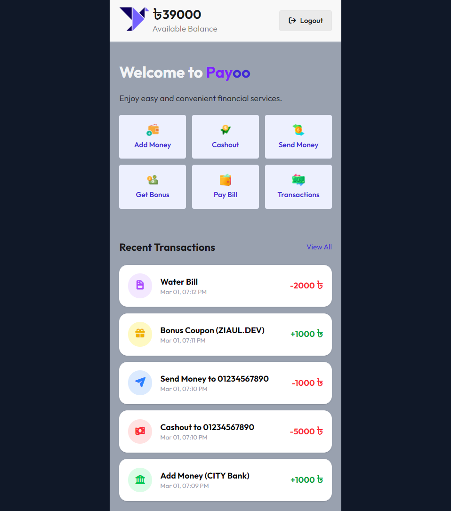

# Payoo — Mobile Banking Web App

A mobile-first banking web application built with HTML, Tailwind CSS, DaisyUI, and vanilla JavaScript. Payoo simulates core digital banking features including fund transfers, bill payments, cashouts, and bonus coupons — all with persistent data via localStorage.

---

## 🚀 Live Demo

🔗 [https://payoo-code.vercel.app/](https://payoo-code.vercel.app/)

> **Demo Credentials**
> - Mobile Number: `01234567890`
> - PIN: `1234`

---
## 📸 Screenshots



---
## 📁 Project Structure

```
payoo/
├── index.html          # Login page
├── home.html           # Main dashboard
├── assets/             # Images and icons
│   ├── logo.png
│   ├── Logo-full.png
└── script/
    ├── login.js        # Login authentication
    ├── home.js          # Main app controller (navigation + all features)
    └── utils.js        # Shared utility functions
```

---

## ✨ Features

### 🔐 Authentication
- Login with mobile number (11 digits) and 4-digit PIN
- Input validation with toast notifications
- Auto-fill demo credentials on login page for easy exploration

### 💰 Add Money
- Select bank (DBBL, IBBL, City Bank)
- Enter bank account number and amount
- PIN verification before transaction
- Balance updates instantly and persists on reload

### 🏧 Cashout
- Withdraw funds via agent number
- Validates sufficient balance before processing
- Transaction recorded in history

### 📤 Send Money
- Transfer funds to any 11-digit user account
- Real-time balance deduction
- Transaction recorded with recipient number

### 🎁 Get Bonus
- Redeem bonus coupon codes
- Available coupons:
  - `ZIAUL.DEV` → +৳1,000
  - `DEVELOPER_ZIAUL` → +৳500

### 🧾 Pay Bill
- Supports: Electricity, Water, Gas, Internet
- Enter biller account number and amount
- PIN-secured payment

### 📋 Transaction History
- Dynamic list — updates after every transaction
- Color-coded icons by transaction type
- Shows amount, label, and timestamp
- Full history view + recent preview on home dashboard

---

## 🛠️ Tech Stack

| Technology | Purpose |
|---|---|
| HTML5 | Page structure and markup |
| Tailwind CSS | Utility-first styling |
| DaisyUI | Pre-built UI components (cards, buttons, inputs) |
| Vanilla JavaScript (ES Modules) | App logic and interactivity |
| localStorage | Persistent balance and transaction data |
| Font Awesome | Icons |

---

## 💾 Data Persistence

All data is stored in the browser's `localStorage` so it survives page reloads:

| Key | Description |
|---|---|
| `payoo_balance` | Current user balance |
| `payoo_transactions` | Full transaction history (JSON array) |

---

## 🧭 Navigation Flow

```
index.html (Login)
    └── home.html (Dashboard)
            ├── Add Money
            ├── Cashout
            ├── Send Money
            ├── Get Bonus
            ├── Pay Bill
            └── Transaction History
```

Each service section is shown/hidden dynamically — no page reloads needed. Every section has a **Back** button to return to the home dashboard.

---

## ⚙️ How to Run Locally

1. Clone the repository:
   ```bash
   git clone https://github.com/ziaul-hoque4820/payoo-code.git
   ```

2. Open `index.html` in your browser directly, or use a local server:
   ```bash
   # Using VS Code Live Server extension (recommended)
   # Or using Python
   python -m http.server 5500
   ```

3. Login with demo credentials:
   - Number: `01234567890`
   - PIN: `1234`

---

## 📌 Notes

- This is a **frontend-only** demo project. No real banking transactions are performed.
- All credentials and coupon codes are hardcoded for demonstration purposes.
- Designed for **mobile viewport** (max-width: 448px) but accessible on desktop.

---

## 👨‍💻 Developer

**Ziaul Hoque**
- GitHub: [@ziaul-hoque4820](https://github.com/ziaul-hoque4820)
